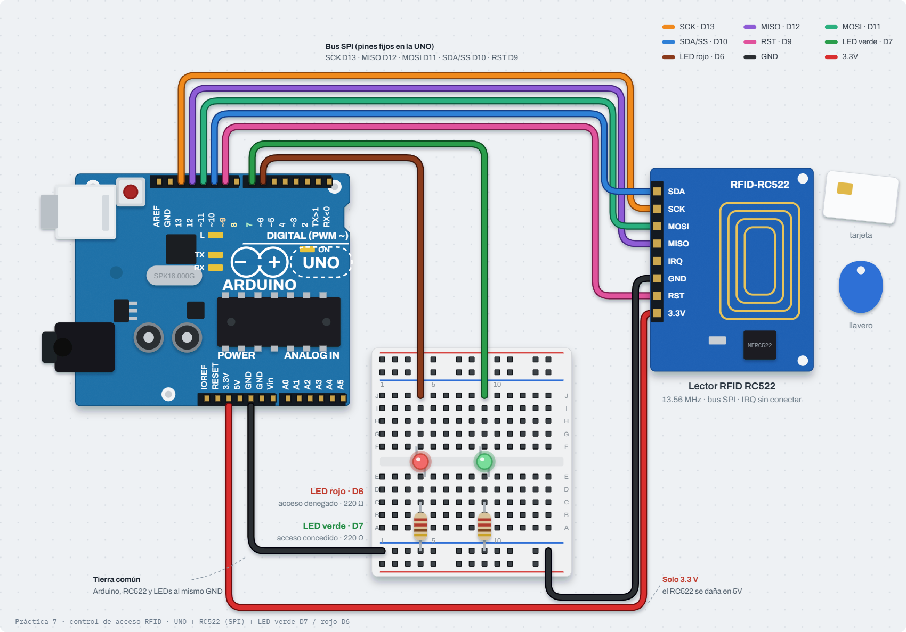

# Nombre del proyecto
Control de acceso con RFID RC522 (bus SPI)

## Descripción
El Arduino se comunica por el bus SPI con un lector RFID RC522, lee el
número único (UID) de una tarjeta o llavero y lo muestra en el Monitor Serie
en hexadecimal. Con ese UID simula un control de acceso: una tarjeta
autorizada enciende el LED verde y una no autorizada el rojo, cada uno
durante 2 segundos. Como extra, la matriz LED integrada de la UNO R4 WiFi
escribe **ACEPTADO** o **RECHAZADO**.

## Objetivos
- Conectar un periférico por el bus SPI (SCK, MOSI, MISO, SS) y verificar que
  hay comunicación antes de usarlo.
- Leer el UID de tarjetas RFID de 13.56 MHz y mostrarlo en hexadecimal.
- Tomar decisiones con el UID (autorizado / no autorizado).
- Controlar el tiempo de los LEDs con `millis()` para que el programa siga
  leyendo tarjetas mientras un LED está encendido.

## Herramientas y material utilizado
- Arduino UNO R4 WiFi (con su matriz LED 12×8 integrada)
- Módulo lector RFID RC522 con tarjeta y llavero
- 1 LED verde y 1 LED rojo con sus resistencias, protoboard y cables
- Librerías `MFRC522` y `ArduinoGraphics` (Library Manager); `SPI` y
  `Arduino_LED_Matrix` vienen con el core de la R4
- Arduino IDE y Monitor Serie

## Diagrama
El RC522 va a los pines SPI de la UNO (SCK D13, MISO D12, MOSI D11, SDA/SS
D10, RST D9) y se alimenta **solo con 3.3 V**: a 5 V se daña. El LED verde va
en D7 y el rojo en D6, cada uno con su resistencia, y todo comparte tierra.

**Preguntas del bus SPI**
- **SCK, MOSI, MISO y CS:** SCK (*Serial Clock*) es el reloj que marca cada bit; MOSI
  (*Master Out Slave In*) lleva datos del Arduino al lector; MISO (*Master In Slave
  Out*) los trae del lector al Arduino; CS (*Chip Select*, o SS) activa en LOW al
  dispositivo con el que se quiere hablar.
- **¿Por qué el pin dice "SDA"?** El chip MFRC522 también puede usar I2C o UART y el
  módulo rotula el pin con su nombre de I2C. En SPI ese pin funciona como **SS/CS**
  (D10): selecciona al lector.
- **¿Por qué línea viaja el UID?** Por **MISO** (D12), la única que va del lector al
  Arduino.
- **Segundo lector RC522:** compartiría SCK, MOSI, MISO, 3.3V y GND; lo que cambia es
  el **SS/CS** (por ejemplo D8), para elegir con cuál lector hablar. RST puede
  compartirse o ir a otro pin.

## Código
Al arrancar lee el registro de versión del lector para confirmar que hay
comunicación. Cada tarjeta nueva imprime `UID: 3A F2 1C 7B` y se compara con
la lista de autorizadas; cada LED tiene su propio temporizador con `millis()`
y el texto de la matriz avanza una columna cada 60 ms, así que nada bloquea
la lectura. UIDs y librerías en [Codigo/Readme.txt](Codigo/Readme.txt).

**¿Por qué no se permitió `delay()`?** Porque congela todo el programa: con un
`delay(2000)` para el LED, el Arduino no leería tarjetas ni movería el texto de la
matriz durante esos 2 s, y la prueba 3 (tarjeta no autorizada con el LED encendido)
fallaría. Con `millis()` solo se revisa si ya pasó el tiempo y el `loop()` sigue.

[Ver código](Codigo/)

## Reporte
El reporte contiene la metodología (bus SPI, lectura del UID, control de
acceso sin bloqueo y texto en la matriz), las conexiones, el diagrama, las
pruebas y las conclusiones técnicas.

[Ver Reporte](Reporte/Reporte-Control-de-Acceso-RFID.pdf)

## Resultados
UIDs leídos: llavero `99 EB 7B 63` y tarjeta `AA 25 60 E4`.

**¿Qué pasó al desconectar MISO?** Al reiniciar, el Monitor Serie mostró
`ERROR: no hay comunicacion con el RC522`. Sin MISO la respuesta del lector nunca
llega: al leer el registro de versión el Arduino obtiene 0x00 o 0xFF en lugar de
0x91/0x92, y por eso detecta que no hay comunicación; tampoco puede leer ningún UID.
Al reconectar el cable y reiniciar, el lector vuelve a detectarse.

PENDIENTE: capturas del Monitor Serie y resultado de las 4 pruebas. Ver
[Resultados/Readme.txt](Resultados/Readme.txt).

## Video
PENDIENTE: [Ver carpeta Video](Video/)

## Conclusiones
El bus SPI permite hablar con el lector usando cuatro líneas compartidas y
una de selección (SS) por dispositivo; comprobar el registro de versión al
arrancar distingue un lector sin comunicación de uno que simplemente no ve
tarjetas.

Usar `millis()` en lugar de `delay()` es lo que permite negar una tarjeta
mientras el LED de otra sigue encendido: el programa nunca se queda
esperando, igual que en la Práctica 2.
