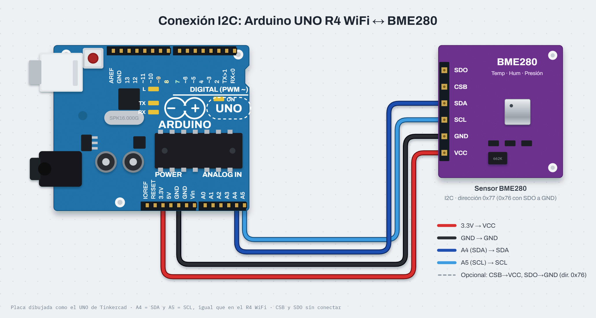

# Nombre del proyecto
Estación barométrica con sensor BMP280 (bus I2C)

## Descripción
El Arduino UNO R4 WiFi lee por el bus I2C un sensor ambiental BMP280 y obtiene
temperatura, presión atmosférica y altitud estimada. Los datos salen por el
Monitor Serie / Serial Plotter cada segundo y la matriz LED integrada alterna
entre la temperatura (°C) y la altitud (m). Todo se temporiza con `millis()`,
sin `delay()`.

## Objetivos
- Conectar un sensor por el bus I2C (SDA, SCL) y detectar su dirección
  (0x76 o 0x77) y su Chip ID antes de usarlo.
- Distinguir un BMP280 (ID 0x58) de un BME280 (ID 0x60).
- Graficar las lecturas en el Serial Plotter con el formato `etiqueta:valor`.
- Detectar lecturas inválidas o un sensor desconectado y reintentar sin
  bloquear el programa.

## Herramientas y material utilizado
- Arduino UNO R4 WiFi (con su matriz LED 12×8 integrada)
- Módulo sensor BMP280 (o BME280)
- Cables y protoboard
- Librerías `Adafruit BMP280 Library`, `Adafruit Unified Sensor` y
  `ArduinoGraphics` (Library Manager); `Wire` y `Arduino_LED_Matrix` vienen
  con el core de la R4
- Arduino IDE, Monitor Serie y Serial Plotter (115200 baudios)

## Diagrama
El sensor se alimenta con **3.3 V** y su bus I2C va a A4 (SDA) y A5 (SCL) de
la UNO, con GND común. CSB y SDO quedan sin conectar, así que responde en la
dirección 0x77 (0x76 si SDO va a GND).

## Código
Al arrancar busca el sensor en 0x76 y 0x77 leyendo su registro de Chip ID;
si es un BMP280 lo configura en modo normal (presión ×16, filtro IIR ×16).
Cada 1 s imprime `Temp_C:..,Presion_Atm_hPa:..,Altura_nivel_mar_m:..` y cada
2.5 s cambia lo que muestra la matriz. Si no hay sensor muestra `ERR` y
reintenta cada 5 s. Detalles en [Codigo/Readme.txt](Codigo/Readme.txt).

[Ver código](Codigo/)

## Reporte
PENDIENTE: reporte con la metodología (bus I2C, Chip ID, configuración del
sensor, temporización con `millis()`), conexiones, diagrama, pruebas y
conclusiones.

[Ver carpeta Reporte](Reporte/)

## Resultados
PENDIENTE: lecturas reales del sensor, gráfica del Serial Plotter y prueba
de desconexión. Ver [Resultados/Readme.txt](Resultados/Readme.txt).

## Video
PENDIENTE: video del montaje y la matriz alternando temperatura y altitud.

[Ver carpeta Video](Video/)

## Conclusiones
PENDIENTE: se redactan después de probar el circuito armado.
