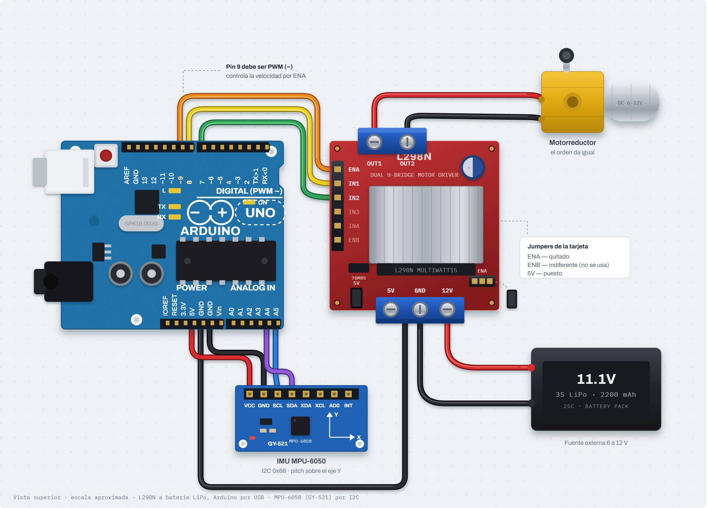
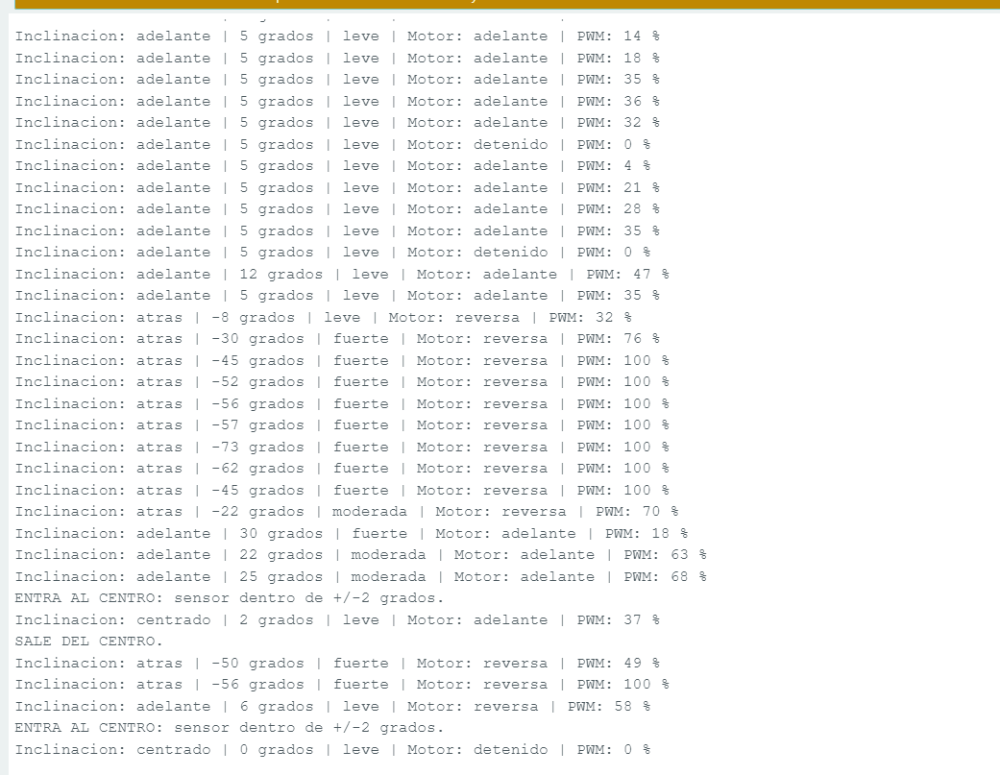

# Nombre del proyecto
Inclinómetro con control de motorreductor (IMU MPU-6050)

## Descripción
El Arduino UNO R4 WiFi lee la inclinación frontal (pitch) de un MPU-6050 por
I2C y con ella controla un motorreductor a través de un puente H L298N: el
signo del ángulo decide la dirección y su magnitud la velocidad. El motor
acelera con rampa, se queda quieto en una zona muerta de ±5° y se detiene al
instante si se pierde el sensor. La matriz LED integrada muestra un punto que
sube o baja con la inclinación.

## Objetivos
- Leer acelerómetro y giroscopio del MPU-6050 por registros I2C y verificar el
  sensor con `WHO_AM_I` (0x68).
- Combinar ambos con un filtro complementario para obtener un ángulo estable.
- Controlar dirección y velocidad (PWM) de un motor DC con el L298N, con zona
  muerta, velocidad mínima útil y rampa de aceleración.
- Detener el motor de inmediato ante una falla del sensor (failsafe).
- Correr cuatro tareas concurrentes con `millis()`, sin `delay()`.

## Herramientas y material utilizado
- Arduino UNO R4 WiFi (con su matriz LED 12×8 integrada)
- Módulo MPU-6050 (GY-521)
- Driver L298N y motorreductor DC
- Batería LiPo 3S (11.1 V) para el motor
- Resistencia de 10 kΩ entre ENA y GND (motor deshabilitado al arrancar)
- Cables y protoboard
- Librerías `Wire` y `Arduino_LED_Matrix` (vienen con el core de la R4; el
  MPU-6050 se lee por registros, sin librería externa)
- Arduino IDE y Monitor Serie (115200 baudios)

## Diagrama
MPU-6050: VCC→5V, GND→GND, SDA→A4, SCL→A5. L298N: ENA→D9 (PWM, sin el
jumper), IN1→D8, IN2→D7, GND común; la batería va a 12V/GND del L298N y el
motor a OUT1/OUT2.

## Código
`Inclinometro_Motor_R4.ino`: arranca con las salidas del motor en BAJO,
verifica `WHO_AM_I`, configura ±2 g / ±250 °/s (filtro interno 44 Hz, 100
muestras/s), calibra el giroscopio con 500 lecturas y toma el ángulo inicial
del acelerómetro. Cuatro estados (BLOQUEADO, ACTIVO, PARO, RECUPERANDO) y
cuatro tareas: sensor y filtro (10 ms), rampa y motor (20 ms), Monitor Serie
solo si algo cambia (500 ms) y matriz LED (50 ms). En una falla reintenta el
sensor cada 250 ms.
Detalles en [Codigo/Readme.txt](Codigo/Readme.txt).

[Ver código](Codigo/)

## Reporte
Metodología (arranque seguro, filtro complementario, zona muerta, rampa,
failsafe y tareas con `millis()`), conexiones, diagrama, respuestas a las
preguntas de análisis y conclusiones.

[Ver Reporte](Reporte/Reporte-Inclinometro-IMU-Motorreductor.pdf)

## Resultados
El motor siguió la inclinación: adelante de 44 % (10°) a 100 % (desde ~40°),
en reversa de 32 % (−8°) a 100 % (−45° o más), y detenido en el centro con
"ENTRA AL CENTRO" / "SALE DEL CENTRO". La rampa se nota en el Monitor Serie:
al pasar de −56° a +6° el motor sigue "reversa 58 %" mientras frena antes de
invertir.

## Video
El video muestra el código y el Monitor Serie, y el motorreductor cambiando de
sentido y velocidad al inclinar el MPU-6050.

[Ver video](https://youtu.be/_UTnJtDEshI) · [Ver carpeta Video](Video/)

## Conclusiones
Ni el acelerómetro (ruidoso con las sacudidas) ni el giroscopio (con deriva)
bastan solos; el filtro complementario combina lo mejor de ambos. La zona
muerta, la velocidad mínima de 90 y la rampa hacen que el motor responda
suave, y el failsafe aplica el principio de que un actuador sin información
del sensor debe detenerse de inmediato.
